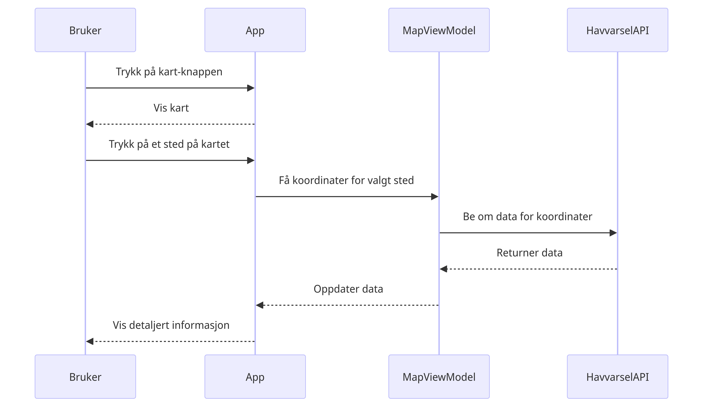

# Modeling and System Design

### Most important functional requirements

1. The app should display an interactive map with detailed information such as wind, sea temperature, and other relevant data.
2. The app should provide an overview of favorite places with relevant information and intuitive functionality to add/remove places.

## Use Case 1: Adding a Favorite Place

### Use Case Description
The "Adding a Favorite Place" use case allows users to add a location to their list of favorite places. This functionality enhances user experience by providing quick access to frequently checked locations, along with their relevant weather information.

**Steps:**
1. **Initiation**: The user opens the app and navigates to the main screen.
2. **Access Search Functionality**: The user presses the "+" button to add a new favorite place.
3. **Input Location**: A search bar appears, prompting the user to enter the name of the place they wish to add.
4. **Display Suggestions**: As the user types, the app fetches location suggestions from the EnTur API and displays them below the search bar.
5. **Select Location**: The user selects the desired location from the list of suggestions.
6. **Fetch Data**: Upon selection, the app retrieves detailed weather data for the chosen location using the MetAlerts API, LocationForecast API, and HavVarsel API.
7. **Add to Favorites**: The location, along with its weather information, is added to the user's list of favorite places.
8. **Confirmation**: The app provides feedback to the user, confirming that the location has been successfully added.

### Use Case Diagram

### Sequence Diagram

### Class Diagram

### Activity Diagram

---

## Use Case 2: Navigating and Getting Information on the Map

### Use Case Description
The "Navigating and Getting Information on the Map" use case enables users to interact with a map to obtain detailed weather information for specific locations. This functionality provides an intuitive way for users to explore weather data.

**Steps:**
1. **Initiation**: The user opens the app and navigates to the map screen by pressing the "Map" button.
2. **Display Map**: The app displays an interactive map centered on a default location.
3. **Navigate Map**: The user can pan and zoom on the map to explore different areas.
4. **Select Location**: The user clicks on a specific location on the map.
5. **Fetch Data**: The app retrieves detailed weather data for the selected location using APIs.
6. **Display Information**: A weather information card appears on the map, displaying relevant data such as wind speed, sea temperature, and other metrics.
7. **Interact with Data**: The user can click on the weather information card to see more detailed forecasts or navigate to another screen for more in-depth information.
8. **Continuous Interaction**: The user can continue to click on different locations on the map to get weather information for those areas.

### Use Case Diagram

### Sequence Diagram

### Class Diagram

