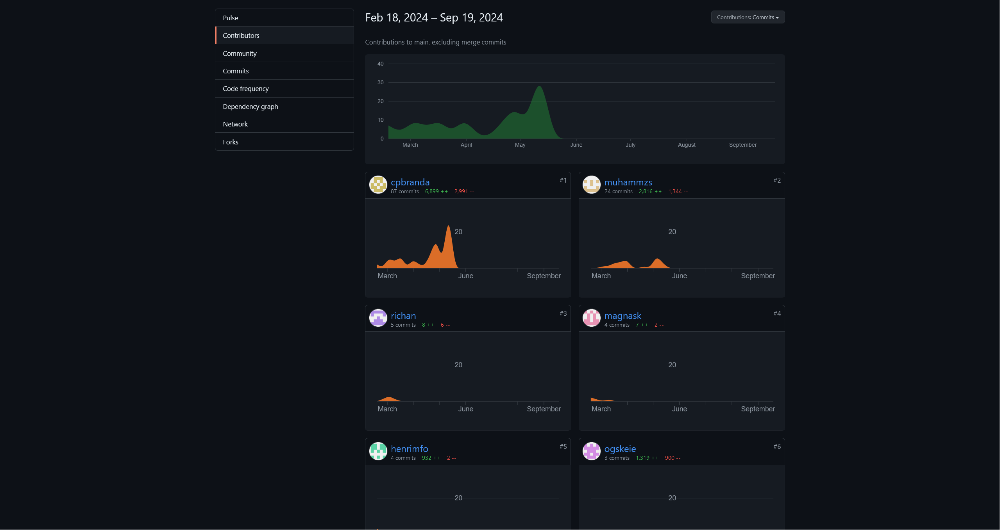

# Team-44
* Ola - ogs****@uio.no
* Carl Philip Bertelsen Brandal - cpbranda@uio.no
* Muhammad - muham***@uio.no
* Richard - ric***@uio.no
* Magnus - magn***@uio.no
* Henrik - henri***@uio.no

This README is mostly for developers and others who want a deeper insight into our project.
For more user-oriented information, see the rapport on pages 6-12.

# Title: **HavBlikk**

## Introduction
This app is designed to provide real-time, accurate weather forecasts for both ocean and land. The app also offers detailed information such as wind, UV-index, currents, and salinity.

## Visuals

    
    
   
 
    

    

    
    
    

    
    
    

## Key Features
- Real-time weather and ocean forecasts.
- Interactive maps and location services.
- Data visualization for temperature and salinity metrics.

## Documentation
- [HavVarsel](https://api.havvarsel.no/apis/duapi/havvarsel/v2/swagger-ui.html)
- [MetAlerts](https://api.met.no/weatherapi/metalerts/2.0/documentation)
- [BigDataCloud Reverse Geocoding](https://www.bigdatacloud.com/free-api/free-reverse-geocode-to-city-api)
- [LocationForecast](https://docs.api.met.no/doc/locationforecast/HowTO.html)
- [EnTur](https://developer.entur.org/pages-geocoder-api)
- [OceanForecast](https://docs.api.met.no/doc/oceanforecast/datamodel)
- [Material3](https://developer.android.com/develop/ui/compose/designsystems/material3)
- [Datastore](https://developer.android.com/topic/libraries/architecture/datastore)
- [Ktor](https://ktor.io/docs/welcome.html)

For further documentation regarding our code, check out `ARCHITECTURE.md` and `MODELING.md`.

## Usage in Android Studio
1. Clone the git repository from [Github](https://github.uio.no/IN2000-V24/team-44).
2. Open the project in Android Studio.
3. Make sure SDK version is 26 (Android version 8.0) or above.
4. Run the app.

## Usage on Physical Android Device
There are multiple ways to use the app on a physical Android device:

1. **Connect via USB:**
    - Connect the device to the computer using a USB cable. Ensure USB debugging is activated on the device.

2. **Pair Devices Using Wi-Fi:**
    - Use Android Studio's 'Pair devices using Wi-Fi' feature. Connect using a QR code or a 6-digit code, available in the developer settings on the physical device.

3. **Connect via ADB (Android Debug Bridge):**
    - In the developer settings, navigate to 'connect via code'.
    - On the computer, use command-line tools to run `adb pair <IP-number:Port-number>`.
    - Run the app in Android Studio.

## Libraries and Frameworks Used
In our project, we have leveraged several key libraries and frameworks to enhance functionality and streamline development:
- **Jetpack Compose** for modern, efficient UI development.
- **Material Design Components** This dependency includes Material Design components for Android apps, providing UI components and styles consistent with Google's Material Design guidelines.
- **Coil Compose** This dependency provides support for loading and displaying images in Jetpack Compose, the modern UI toolkit for building native Android apps.
- **Ktor** for networking, enabling robust client-server communication.
- **Mapbox** for extensive mapping services.
- **Google Play Services Location** to enhance location accuracy and capabilities.
- **AndroidX** libraries for backward compatibility and modern Android features.
- **JUnit** and **Espresso** for thorough testing to ensure application reliability.
- **Ycharts** for creating and styling graphs.

These tools collectively support building a dynamic, responsive, and user-friendly mobile application.

Statistics:

